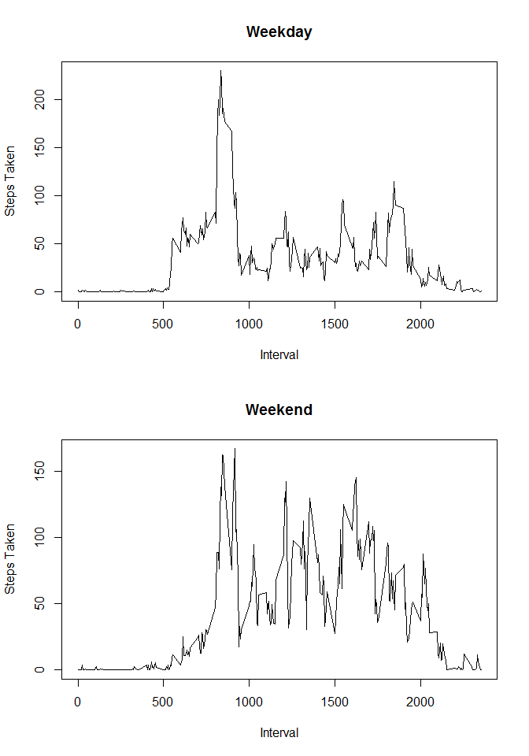

# Reproducible Research: Peer Assessment 1

---

## By Syd-
From https://github.com/Syd-/RepData_PeerAssessment1

---

## Loading and preprocessing the data
To prepare the date, we:  
- read the csv and load it into a dataset.  
- change the *date* column into a date instead of a string.  

```r
dataSet <- read.csv("activity.csv")
dataSet$date <- as.Date(dataSet$date)
```

---

## What is mean total number of steps taken per day?
We compute total number of steps taken by aggregating steps vs date from the dataset, and ignoring NAs.  

```r
totalSteps <- aggregate(steps~date, FUN = sum, na.action = na.omit, data = dataSet)
```
#### Histogram: total steps taken vs date

```r
library("ggplot2")
ggplot(data=totalSteps) + geom_histogram(aes(x=date, y=steps), stat="identity")
```

 

#### Mean: total number of steps taken per day

```r
mean(totalSteps$steps)
```

```
## [1] 10766.19
```
#### Median: total number of steps taken per day

```r
median(totalSteps$steps)
```

```
## [1] 10765
```

---

## What is the average daily activity pattern?
We compute mean number of steps taken per interval by aggregating steps vs interval from the dataset, and ignoring NAs.  

```r
dailyPattern <- aggregate(steps~interval, FUN = mean, na.action = na.omit, data = dataSet)
```
#### Time Series Plot: average steps taken vs 5-minute intervals

```r
plot(dailyPattern, type="l")
```

 

#### The 5 minute interval, on average across all days that contains the maximum number of steps is:

```r
dailyPattern[dailyPattern$steps == max(dailyPattern$steps), ]$interval
```

```
## [1] 835
```

---

## Inputing missing values
#### The total number of rows with missing values is

```r
sum(is.na(dataSet$steps))
```

```
## [1] 2304
```
#### Fill in missing values in the dataset
The strategy is rather naive:  
Given an interval with a missing value for a particular day:  
We insert the mean for the missing interval across all days.  

```r
newDataSet <- within(
  dataSet, 
  steps <- ifelse(
    is.na(steps),
    dailyPattern[match(interval, dailyPattern$interval), c("steps")],
    steps
  )
)
newTotalSteps <- aggregate(steps~date, FUN = sum, na.action = na.omit, data = newDataSet)
```
#### Histogram: total steps taken vs date

```r
ggplot(data=newTotalSteps) + geom_histogram(aes(x=date, y=steps), stat="identity")
```

 

#### Mean: total number of steps taken per day

```r
mean(newTotalSteps$steps)
```

```
## [1] 10766.19
```
#### Median: total number of steps taken per day

```r
median(newTotalSteps$steps)
```

```
## [1] 10766.19
```
Since we chose to replace NA values with the mean for the same interval,  
- **mean** has stayed the same.  
- **median**, however, has increased.  

---

## Are there differences in activity patterns between weekdays and weekends?

#### Adding a day column to the new data set that indicates whether a date is a "weekday" or "weekend".  

```r
newDataSet <- cbind(
  newDataSet, 
  day = ifelse(
    is.na(
      match(
        weekdays(newDataSet$date),
        c("Saturday", "Sunday")
      )
    ), "weekday", "weekend"
  )
)
```

#### Averaging steps taken across intervals for weekdays and weekends

```r
# Aggregate across interval AND weekend|weekday
newDailyPattern <- aggregate(newDataSet$steps, by=list(newDataSet$interval, newDataSet$day), FUN = mean)
# Panels for panel plot
par(mfrow=c(2,1))
# Plot Weekday
plot(
  newDailyPattern$Group.1[newDailyPattern$Group.2 == "weekday"],
  newDailyPattern$x[newDailyPattern$Group.2 == "weekday"],
  type="l",
  ylab="Steps Taken",
  xlab="Interval",
  main="Weekday")
# Plot Weekend
plot(
  newDailyPattern$Group.1[newDailyPattern$Group.2 == "weekend"],
  newDailyPattern$x[newDailyPattern$Group.2 == "weekend"],
  type="l",
  ylab="Steps Taken",
  xlab="Interval",
  main="Weekend")
```

 

From the above, we can conclude that there is more activity on weekends than on weekdays.

---
